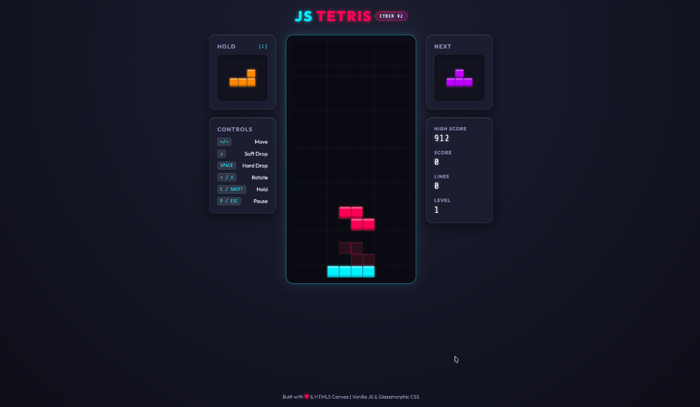

# JS Tetris // Cyber Edition

[](https://opensource.org/licenses/ISC)




A premium, responsive, cyberpunk-themed Tetris clone built using **HTML5 Canvas**, **Vanilla CSS Glassmorphism**, and **ES6 JavaScript**. This application runs at a buttery-smooth 60FPS, features neon-glowing cyber-aesthetics, and includes modern game engine features like hold piece, ghost piece previews, line clear animations, level scaling, and persistent high scores.

---

## 🎮 Live Preview & Aesthetics

The interface is built to wow at first glance, incorporating:
- **Neon Synthwave Cyberpunk Theme:** Glowing cyber-blocks in cyan, electric blue, orange, yellow, green, purple, and hot pink.
- **Glassmorphic UI Cards:** Semi-transparent containers featuring backdrop filters (`blur(16px)`), subtle reflections, and animated borders.
- **High-DPI Canvas Rendering:** Pixel-perfect rendering of active and frozen blocks with inner bevel highlights for a premium 3D glass look.
- **Responsive Layout:** Automatically scales across desktop, tablet, and mobile browsers with specialized on-screen D-pad and action buttons.

---

## ✨ Features

- **Standard Game Mechanics:** Full collision detection, standard 7-bag randomizer, and SRS-like wall kicks for smooth rotations.
- **Ghost Piece Preview:** Shows where the active piece will land, allowing for fast, precise gameplay.
- **Hold & Queue System:** Store a piece for later swapping (default key `C` or `Shift`) and preview the upcoming piece.
- **Advanced State Controller:** Interactive overlay menus for **Welcome / Start**, **Pause**, and **Game Over** states.
- **Level & Speed Scaling:** Game speed dynamically increases as you clear lines (every 10 lines triggers a level up).
- **Score System:** Multi-line clear scoring multipliers (Single, Double, Triple, and Tetris) with persistent High Score tracking via `localStorage`.
- **On-Screen Mobile Controls:** Virtual controls for mobile devices that map perfectly to physical touch buttons.

---

## 📂 Project Structure

The project has been organized into a clean, modular, industry-standard architecture separating source code from compiled build output:

```
├── dist/                # Auto-generated build artifacts (cleanly ignored by git)
│   ├── index.html       # Compiled SEO-optimized HTML with auto-injected bundles
│   └── main.[hash].js   # Compiled and minified JS bundle with CSS styles
├── src/
│   ├── index.html       # Source HTML template with accessibility & SEO tags
│   ├── style.css        # Cyberpunk glassmorphic CSS rules & responsive design
│   ├── constants.js     # Tetrimino shapes, scoring rules, keys, and cyber-colors
│   ├── piece.js         # Piece class managing coordinates, cloning, and rotations
│   ├── board.js         # Grid logic, collisions, SRS wall kicks, and row clearance
│   ├── renderer.js      # Retina-ready Canvas rendering loops, glows, and previews
│   ├── game.js          # Controller handling loop timers, states, 7-bag, and scores
│   └── index.js         # Entry point binding DOM events, keyboard, and touch controls
├── tests/               # Automated unit test suites (Jest)
│   ├── board.test.js    # Unit tests for grid collisions, freezing, and line clears
│   └── piece.test.js    # Unit tests for matrix cloning and SRS rotation logic
├── eslint.config.js     # ESLint flat configuration for code quality checking
├── package.json         # Scripts and dev dependencies
└── webpack.config.js    # Webpack 5 configuration with HtmlWebpackPlugin & CSS loaders
```

---

## 🚀 Setup & Installation

### Prerequisites

Ensure you have [Node.js](https://nodejs.org/) (v16+ recommended, fully compatible with Node 24+) and `npm` installed.

### 1. Install Dependencies

Clone the repository and run:

```bash
npm install
```

### 2. Automated Testing & Code Quality

To execute the Jest automated test suite for game logic:

```bash
npm test
```

To run ESLint code linting and Prettier formatting:

```bash
npm run lint
npm run format
```

### 3. Development Mode

To run a development watch server that auto-compiles changes in the `src/` directory:

```bash
npm run dev
```

### 4. Production Build

To compile, hash, and minify the production bundle to `dist/`:

```bash
npm run build
```

### 5. Running the Game

After building, serve the generated `dist/` directory using a local development server:

```bash
npx serve dist
```

---

## 🕹️ Controls Guide

### Keyboard Mappings

| Action | Primary Key | Alternative Key |
| :--- | :--- | :--- |
| **Move Left** | `Left Arrow` | - |
| **Move Right** | `Right Arrow` | - |
| **Soft Drop** | `Down Arrow` | - |
| **Rotate Right** | `Up Arrow` | `X` |
| **Rotate Left** | - | `Z` |
| **Hard Drop** | `Space` | - |
| **Hold Piece** | `C` | `Shift` |
| **Pause / Resume**| `P` | `Escape` |

### Touch (Mobile & Tablet)

- **Left D-Pad Buttons:** Move Left, Soft Drop, Move Right.
- **Right Action Buttons:** Rotate (CW), Hard Drop, Hold Piece.
- **Sidebar Button:** Pause / Resume overlay.

---

## 📄 License

This project is open-source and licensed under the [ISC License](LICENSE).
